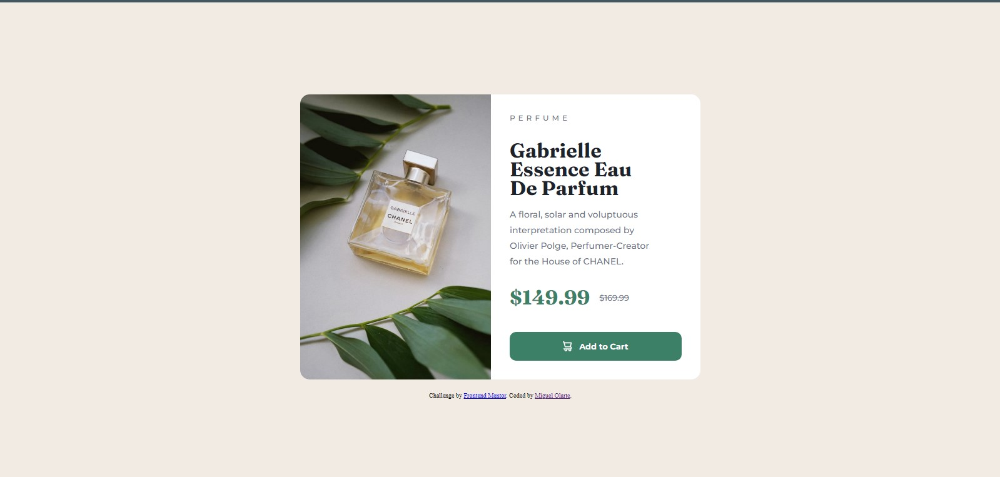
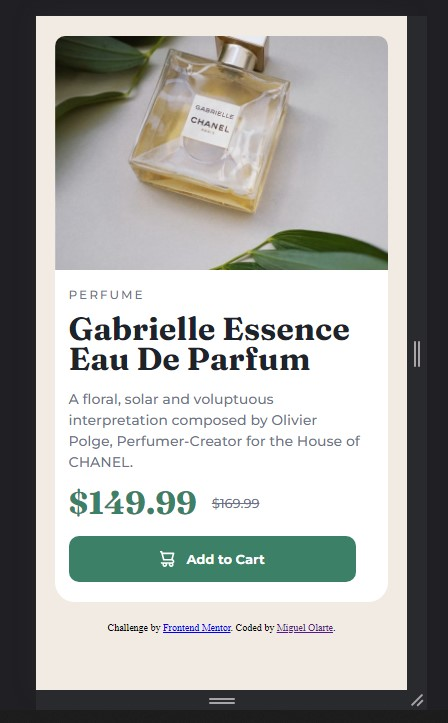

# Frontend Mentor - Product preview card component solution

This is my solution to the [Product preview card component challenge on Frontend Mentor](https://www.frontendmentor.io/challenges/product-preview-card-component-GO7UmttRfa). Frontend Mentor challenges help me to improve my coding skills by building realistic projects. 

## Table of contents

- [Overview](#overview)
  - [The challenge](#the-challenge)
  - [Screenshot](#screenshot)
  - [Links](#links)
- [My process](#my-process)
  - [Built with](#built-with)
  - [What I learned](#what-i-learned)
  - [Continued development](#continued-development)
  - [Useful resources](#useful-resources)
- [Author](#author)
- [Acknowledgments](#acknowledgments)

## Overview

### The challenge

Users should be able to:

- View the optimal layout depending on their device's screen size
- See hover and focus states for interactive elements

### Screenshots
Desktop

Mobile

### Links

- Solution URL: [https://github.com/Olarte910903/product-preview-card-component-main](https://github.com/Olarte910903/product-preview-card-component-main)
- Live Site URL: [https://olarte910903.github.io/product-preview-card-component-main/](https://olarte910903.github.io/product-preview-card-component-main/)

## My process

### Built with

- Semantic HTML5 markup
- CSS custom properties
- Flexbox
- Mobile-first workflow (with some problems)

### What I learned

I have learned how to edit the markdown files, and practice a little more my english. I have also practiced with the semantic html tags, since in the previous challenge, some colleagues have recommended it to me and I have tried to apply it in this project, if the html syntax is wrongly written, do not hesitate to help me, so I can learn more.

### Continued development

I want to learn in a more efficient way to layout sites with html and css, that's why I will dedicate myself more in depth in these topics. Since it is a little difficult for me when it comes to layout my projects, because I do not know much about syntactic html and css, I just know the basics, but I want to go deeper into the topics.

### Useful resources

- [lenguajehtml.com](https://lenguajehtml.com/) - This resource helped me to learn html basics.
- [lenguajecss.com](https://lenguajecss.com/) - This resource helped me to learn css basics.
- [MDN](https://developer.mozilla.org/es/) - This resource helped me to learn both, but i dont understand good this page.

## Author

- Website - [Miguel Olarte - Github](https://github.com/Olarte910903)
- Frontend Mentor - [@Olarte910903](https://www.frontendmentor.io/profile/Olarte910903)
- Twitter - [Miguel Olarte](https://www.twitter.com/MiguelO41033679)

## Acknowledgments

Thanks to [Abdul Khalid](https://www.frontendmentor.io/profile/0xAbdulKhalid) for help me in my first project. 

